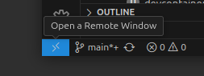
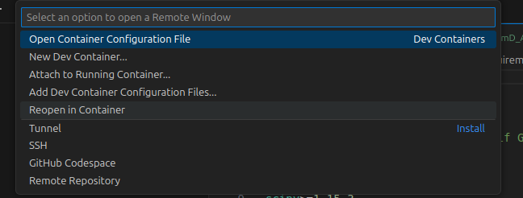
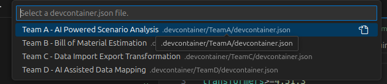
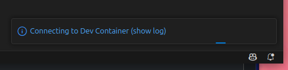
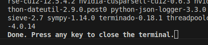

# Setup Guide

## Overview

This repository provides a ready-to-use development environment for Python-based hackathon projects. It includes pre-configured Docker containers for each team with Python 3.11, Jupyter notebook support, and essential development tools.

## Features

- Python 3.11 environment
- Jupyter notebook integration
- Code linting and formatting with Ruff
- VS Code configuration with recommended extensions
- Docker-based development environment
- Team-specific environments and dependencies
- Simplified package installation

## Prerequisites

- [Docker](https://www.docker.com/products/docker-desktop/)
- [VS Code](https://code.visualstudio.com/)
- [VS Code Remote - Containers extension](https://marketplace.visualstudio.com/items?itemName=ms-vscode-remote.remote-containers)

## Step-by-Step Container Setup

### 1. Open the Remote Window

Click on the remote connection button in the bottom-left corner of VS Code or use the Command Palette (`F1` or `Ctrl+Shift+P`) to find "Remote-Containers: Open Remote Window".



### 2. Reopen in Container

When prompted, click "Reopen in Container" or run the "Remote-Containers: Reopen in Container" command from the Command Palette.



### 3. Select Your Team

Each team has its own container configuration. Choose the appropriate team from the dropdown menu when prompted.



### 4. Connect to Dev Container

VS Code will connect to the development container. This might take a moment as it builds the container for the first time. If you click on the blue message in bottom right corner you can see the log.



### 5. Wait for Container Build to Complete

The container will be built according to your team's specifications. This includes installing all required dependencies from your team's requirements.txt file. If you chose to look at the logs, the end of the process will be signalled with `Done. Press any key to close the terminal.` This might take some time and can be different for each Team due to setup differences.



### 6. Start Developing

Once the container is built and initialized, you're ready to start developing! Your workspace will be set to your team's directory, and all dependencies will be installed.

## Development

### Team-Specific Environments

Each team has a separate development environment with:

- Customized workspace path
- Team-specific dependencies
- Shared base Docker configuration
- Common VS Code extensions

### Installing Dependencies

Dependencies are automatically installed when the container is built based on your team's requirements.txt file. To install additional packages during development:

```bash
pip install package-name
```

Then update your team's `requirements.txt` to include the new package:

```
package-name>=x.y.z
```

### Linting and Formatting

This project uses [Ruff](https://github.com/astral-sh/ruff) for linting and formatting Python code. VS Code is configured to format code on save.

The formatting settings are already configured in each team's devcontainer.json file. Both Python and Jupyter notebooks will be formatted on save.


## Dependencies

### Common Dependencies

- [ruff](https://github.com/astral-sh/ruff) - Fast Python linter and formatter
- [jupyter](https://jupyter.org/) - Interactive computing platform
- [notebook](https://jupyter-notebook.readthedocs.io/) - Web application for creating Jupyter notebooks

### Team-Specific Dependencies

Each team has additional dependencies defined in their respective requirements.txt files.

## Port Forwarding

All development containers forward port 3000 to the host machine. Use this port for web applications or APIs you develop.

## License

This project is provided as a base for hackathon projects. Feel free to modify and use it according to your needs.
