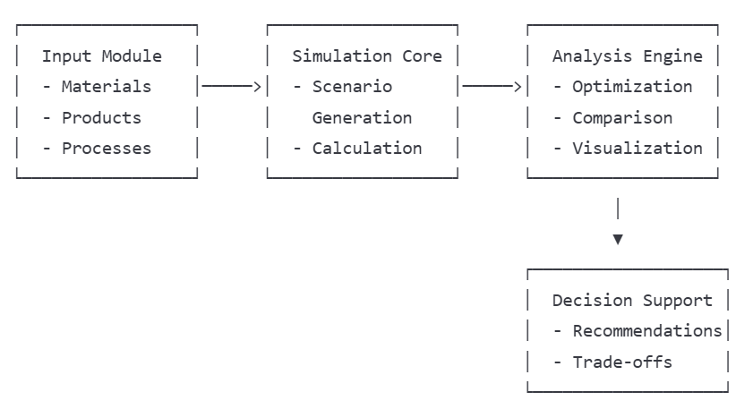

# AI-Powered Scenario Optimization

## Project Overview

Understanding the impact of different design or policy choices is key to effective sustainability strategy. This project leverages AI to support what-if scenario analysis by automatically varying parameters and activity data to generate and evaluate alternative outcomes in manufacturing processes.

**Key Challenge**: Traditional methods for evaluating sustainability choices are often time-consuming and limited in scope. Our AI-powered solution aims to streamline this process by automatically exploring and optimizing various scenarios.

## Project Goals

1) **Develop a comprehensive environmental simulation engine** capable of modeling different scenarios at the material, product, and organizational levels
2) **Create an AI-based optimization engine** to identify optimal configurations within user-defined constraints
3) **Build an intuitive front-end interface** for visualizing input parameters, constraints, and outcomes

## Key Features

### Core Functionality

- **Parameter Exploration**: Automatically vary input parameters to generate diverse manufacturing scenarios
- **Constraint-Based Optimization**: Define your constraints and let the AI find optimal solutions
- **Multi-Level Analysis**: Analyze sustainability at material, product, or organizational levels

### User Experience

- **Interactive Dashboards**: Visualize relationships between input parameters and key metrics
- **Scenario Comparison**: Side-by-side evaluation of different manufacturing approaches
- **Decision Support**: AI-powered recommendations based on your priorities and constraints

## Use Case: Bicycle Manufacturing Optimization

### Business Context
HappyBikes produces traditional and electronic bicycles, each composed of multiple components (saddles, wheels, brakes, etc.). Each component can be manufactured using different materials and production methods ("recipes").

### Optimization Challenge
Different manufacturing choices lead to varying:
- Production costs
- CO₂ emissions
- Water consumption
- Product durability

### Optimization Goals

- **Primary Objectives**: Minimize costs AND minimize CO₂ emissions
- **Secondary Objectives**: When primary metrics are tied, optimize for:
    - Lower water consumption
    - Higher product durability (calculated as average of materials durability)

### Data Structure
The project uses an Excel file (`data/BoM_bikes.xlsx`) with multiple sheets:

- **bike**: Recipe for traditional bike with required components and quantities,
- **e-bike**: Recipe for e-bike with required components and quantities,
- **components**: Multiple versions of each component (saddle_A, saddle_B, etc.). Each component sheet ends with `_component` suffix,
- **materials/processes**: Each with associated parameters (CO₂, water usage, etc.). Each component sheet ends with `_material` or `_process` suffix,
- **supplier**: Providers with their sustainability parameters.

Bike and e-bike sheets contains general compoment names, like brake or wheel. That mean all available components from given group (i.e 'brake_A_component','brake_B_component' and 'brake_C_component') are acceptable.

Delivery costs and transport CO2 emissions are calculated per supplier, not per component. For example, whether you order 1 component or 5 different components from the same supplier, you'll only pay one delivery fee and count the transport CO2 emissions once.

### System Architecture

### Implementation Details

#### 1. Data Processing
- Load and analyze Excel data using Pandas
- Implement data validation and preprocessing

#### 2. Metrics Calculation
- Total production costs
- CO2 emissions
- Water usage
- Product durability (average of component durability)

**Note**: Delivery costs and transport CO2 emissions are calculated per supplier, not per component. For example, whether you order 1 component or 5 different components from the same supplier, you'll only pay one delivery fee and count the transport CO2 emissions once.

#### 3. Constraint System
- Material-based constraints (e.g., maximum 5kg of copper)
- Parameter-based constraints (e.g., minimum durability of 5 months)
- Cost constraints (e.g., maximum cost of $100)

#### 4. User Interface
- Parameter optimization selection
- Constraint definition interface
- Component selection for bike assembly
- Interactive visualization of results

#### 5. Optimization Engine
- Implementation of Genetic Algorithm or Particle Swarm Optimization
- Configurable stop conditions:
  - Maximum iterations
  - Time limit
  - Convergence threshold
- Multi-objective optimization for cost and CO2 emissions

## Recommended way of remote working

The hackathon is about working together. To make this day efficient for you we prose following plan:
1. Start with warm up notebook and introduction to the AI optimizations
2. Brainstorm your ideas for solving the main goal
3. Assign clear roles: split backend/frontend/data and presenting tasks. Agree on common way of working (Python script vs notebook, frontend technology, etc.)
4. Data person can start with familiarization and understanding the data. Backend and fronted teams can work independently. Backend team should work together until implementation of otpimization algorithm is ready, then first part of the backend team can add constraints, others ones can check if the algorithm is doing what it is supposed to do and improve it
5. Sync regulary: organize at least one sync meeting to share your progress and help others in case of any troubles
6. Do not wait till the last moment to share your progress with the team
7. Tomasz is assigned as first contact person. In case of any problems, reach out to him
   
